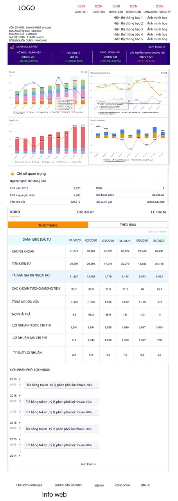

# Exercise Senior Frontend (React) - Part time
Coding in 4 hour.

## Authors

* **Nguyễn Quốc Trường** - *Frontend-developer* - [Github](https://github.com/truong160196)

| | |
| ------ | ------ |
| Full Name| Nguyễn Quốc Trường|
| Email| truong160196@gmail.com |
| Phone| 037.2.136.156 |
| Skill| ReactJS, PHP - Laravel, Java, Web3.js, Solidify|

- follow test live: [demo test](http://demo.remixwebsite.com/)

## Scope
- Create UI follow file Flat_Text.xd
- Mobile and desktop responsive
- Note: menu have to inverted triangle, submerged motifs, font size, shadow, ... 

### Prerequisites
| Name | Description |
| ------ | ------ |
| Module Bundler | [Webpack](https://webpack.js.org/) |
| Library Framework | [ReactJS](https://reactjs.org/), [Redux](https://redux.js.org/) |
| Library Server | [Axios](https://github.com/axios/axios) |
| CSS Framework | [Bootstrap](https://getbootstrap.com/docs/3.4/) |
| CSS | [css framework to reference osaka code(SCSS: react-bootstrap)](https://react-bootstrap.github.io/getting-started/introduction/) |

## Installing

### Install library

```
npm install
```

### Start project

```
npm start
```
Go to browser for now
```
http://localhost:3000
```
### Deployment

```
npm run build
```
# Introduce
### Game connect with metamark
[[Award HB DAPPS HACKATHON 2019](http://game.laptrinhblockchain.net/)
Game using metamask connect with test net in game, using smart contract to exchange item.

## Homeless fund DAPP
[Award Second runner-up](https://www.hackerearth.com/challenges/hackathon/hacking-homelessness/)
develop a blockchain project that supports the donation of charity funds to the homeless
# Trust fund management (in process)


# Blockchain cross-careers (private)
[Customer](https://www.softbank.jp/en/corp/news/press/sbkk/2019/20191023_01)
Develop a network that designed to support several industry-specific use cases including cross-border payments, digital identity, and telecom supply chain, leading to substantial opportunities for industry members.

## License
By Truong.Nguyen
